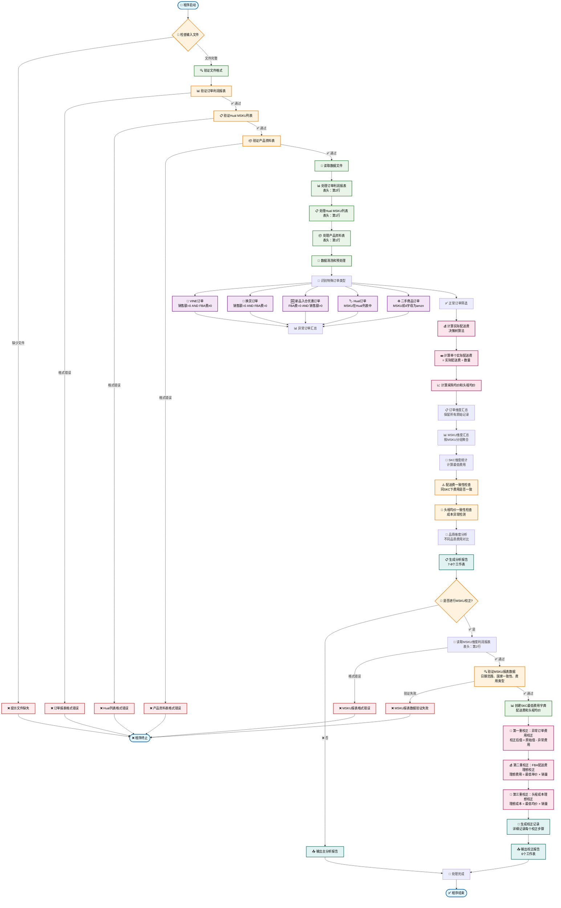
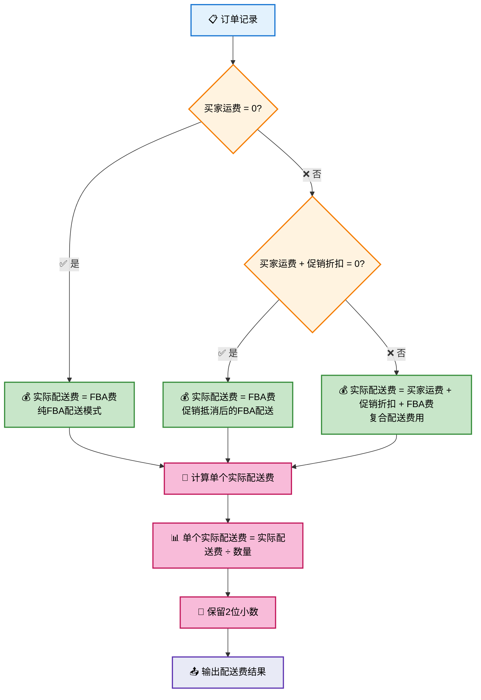

# MSKU表现分析器 - 逻辑流程图 📊

## 🎯 完整程序逻辑流程



---

## 🎨 配送费计算决策树详图



---

## 🔧 三重校正机制详图

```mermaid
flowchart TD
    MSKUReport[📄 MSKU维度利润报表] --> StartCorrection[🔧 开始三重校正]
    AbnormalData[📊 异常订单费用汇总] --> StartCorrection
    SKCMinFees[📋 SKC最低费用字典] --> StartCorrection
    
    StartCorrection --> Phase1[第一重：异常订单费用校正]
    
    Phase1 --> P1Step1[🔍 识别异常订单MSKU]
    P1Step1 --> P1Step2[💰 映射费用字段<br/>FBA费→FBA发货费(FBA)<br/>采购成本→采购成本<br/>头程费用→头程成本]
    P1Step2 --> P1Step3[➖ 扣除异常费用<br/>校正后值 = 原始值 - 异常费用]
    P1Step3 --> P1Record[📝 记录第一重校正]
    
    P1Record --> Phase2[第二重：FBA配送费理想校正]
    
    Phase2 --> P2Step1[📋 获取MSKU对应的SKC]
    P2Step1 --> P2Step2[🔍 查找SKC最低单个实际配送费]
    P2Step2 --> P2Step3[🧮 计算理想FBA发货费<br/>= 最低单价 × (FBA销量 + FBA补换货量)]
    P2Step3 --> P2Step4[🔄 更新FBA发货费字段]
    P2Step4 --> P2Record[📝 记录第二重校正]
    
    P2Record --> Phase3[第三重：头程成本理想校正]
    
    Phase3 --> P3Step1[📊 获取SKC最低头程均价]
    P3Step1 --> P3Step2[🧮 计算理想头程成本<br/>= 最低均价 × (FBA销量 + FBA补换货量)]
    P3Step2 --> P3Step3[🔄 更新头程成本字段]
    P3Step3 --> P3Record[📝 记录第三重校正]
    
    P3Record --> FinalOutput[📤 生成最终校正报告<br/>6个工作表]
    
    FinalOutput --> Sheet1[📋 校正后MSKU报表]
    FinalOutput --> Sheet2[📄 原始MSKU报表]
    FinalOutput --> Sheet3[📊 FBA配送费理想校正记录]
    FinalOutput --> Sheet4[💰 头程成本理想校正记录]
    FinalOutput --> Sheet5[⚠️ 异常订单校正记录]
    FinalOutput --> Sheet6[📊 异常订单费用汇总]
    
    %% 样式
    classDef input fill:#e3f2fd,stroke:#1976d2,stroke-width:2px,color:#000
    classDef phase fill:#fff3e0,stroke:#f57c00,stroke-width:2px,color:#000
    classDef step fill:#e8f5e8,stroke:#2e7d32,stroke-width:2px,color:#000
    classDef record fill:#fce4ec,stroke:#ad1457,stroke-width:2px,color:#000
    classDef output fill:#e0f2f1,stroke:#00695c,stroke-width:2px,color:#000
    
    class MSKUReport,AbnormalData,SKCMinFees input
    class Phase1,Phase2,Phase3 phase
    class P1Step1,P1Step2,P1Step3,P2Step1,P2Step2,P2Step3,P2Step4,P3Step1,P3Step2,P3Step3 step
    class P1Record,P2Record,P3Record record
    class FinalOutput,Sheet1,Sheet2,Sheet3,Sheet4,Sheet5,Sheet6 output
```

---

## 📊 导出为图片的方法

### 🎯 方法一：使用本地HTML查看器（推荐）⭐
1. **打开本地查看器**：双击 `docs/mermaid_viewer.html` 文件
2. **选择预设模板**：
   - 📊 主程序流程图
   - 🌳 配送费决策树
   - 🔧 三重校正机制
3. **生成和导出**：
   - 点击 "🎨 生成流程图" 查看效果
   - 右键流程图保存为图片
   - 或点击 "📁 导出SVG" 按钮

### 🎯 方法二：使用Mermaid Live Editor
1. 访问 [Mermaid Live Editor](https://mermaid-js.github.io/mermaid-live-editor/)
2. 复制上面的Mermaid代码
3. 粘贴到编辑器中
4. 点击 "Actions" → "PNG" 导出PNG图片
5. 或选择 "SVG" 导出矢量图

### 🎯 方法二：使用VS Code插件
1. 安装 `Mermaid Markdown Syntax Highlighting` 插件
2. 安装 `Markdown Preview Mermaid Support` 插件
3. 在VS Code中打开此文档
4. 右键选择 "Markdown: Open Preview to the Side"
5. 在预览中右键流程图，选择 "Copy as Image"

### 🎯 方法三：使用命令行工具
```bash
# 安装mermaid-cli
npm install -g @mermaid-js/mermaid-cli

# 导出PNG
mmdc -i 程序流程图.md -o 程序流程图.png

# 导出SVG
mmdc -i 程序流程图.md -o 程序流程图.svg
```

### 🎯 方法四：使用Typora
1. 在Typora中打开此文档
2. 右键点击流程图
3. 选择 "Copy as Image" 或 "Export as Image"

---

## 🎨 流程图说明

### 📋 颜色编码
- **蓝色** 🔵：开始/结束节点
- **绿色** 🟢：正常处理步骤
- **橙色** 🟠：决策判断节点
- **红色** 🔴：错误处理节点
- **紫色** 🟣：特殊订单类型
- **粉色** 🌸：计算处理节点
- **青色** 🔷：输出结果节点

### 🎯 使用建议
- 保存为 **PNG格式** 用于文档插入
- 保存为 **SVG格式** 用于高分辨率显示
- 可以根据需要调整图片尺寸和DPI
- 建议保存多个版本：完整版、简化版、核心流程版

---

*🎨 这个垂直流程图更加直观地展示了MSKU表现分析器的完整逻辑流程，可以轻松导出为图片格式用于演示和文档！* 