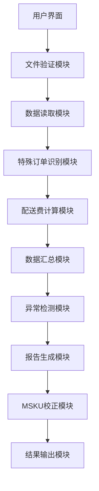
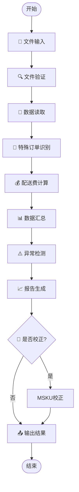

# MSKU表现分析器 - 程序逻辑说明 🔍

## 📋 目录
- [项目概述](#项目概述)
- [架构设计](#架构设计)
- [核心流程](#核心流程)
- [数据处理逻辑](#数据处理逻辑)
- [算法详解](#算法详解)
- [校正机制](#校正机制)
- [异常处理](#异常处理)
- [输出说明](#输出说明)

---

## 🎯 项目概述

MSKU表现分析器是一个专业的亚马逊订单利润分析和配送费优化工具，主要用于：
- 📊 分析订单利润数据中的配送费表现
- 🔍 识别和处理各种异常订单类型
- 📈 生成多维度的统计分析报告
- 🔧 校正MSKU维度利润报表数据

### 🏗️ 技术架构
```
MSKU表现分析器
├── 桌面版 (tkinter + pandas)
│   └── src/core/amazon_profit_analyzer_and_corrector.py
└── Web版 (Flask + pandas)
    ├── src/web/app.py
    ├── templates/
    └── static/
```

---

## 🏛️ 架构设计

### 🔗 主要模块关系



### 📁 数据流向

1. **输入文件** → 文件验证 → 数据读取
2. **原始数据** → 特殊订单识别 → 正常订单筛选
3. **正常订单** → 配送费计算 → 多维度汇总
4. **汇总数据** → 异常检测 → 报告生成
5. **可选校正** → MSKU维度校正 → 最终输出

---

## 🔄 核心流程

### 🚀 主流程概览



### 📋 详细步骤说明

#### 🔸 步骤1：文件读取和验证
- **订单利润报表** 📊
  - 来源：ERP-财务-利润报表-订单
  - 表头位置：第2行（索引为1）
  - 必需字段：`销售额`、`买家运费`、`FBA费`、`促销折扣`、`MSKU`、`采购成本`、`头程费用`、`平台费`、`数量`
  - 日期要求：美国旺季区间（10月15日00:00-次年1月14日23:59）

- **Hual MSKU列表** 📋
  - 来源：Hual产品管理系统
  - 必需字段：`MSKU`
  - 用途：识别Hual订单

- **产品资料表** 📦
  - 来源：产品管理系统
  - 表头位置：第1行
  - 必需字段：`SKC`、`MSKU`、`SKU`、`品质`
  - 用途：建立SKC-MSKU映射关系

- **MSKU维度利润报表** 🔧 (可选)
  - 来源：ERP-财务-利润报表-MSKU
  - 表头位置：第2行
  - 必需字段：`MSKU`、`FBA发货费(FBA)`、`采购成本`、`头程成本`、`平台费`、`FBA销售额`
  - 用途：执行三重校正

#### 🔸 步骤2：特殊订单识别 🎯

程序会自动识别5种特殊订单类型：

1. **VINE订单** 🍇
   - 识别条件：`销售额 = 0` AND `FBA费 ≠ 0`
   - 特征：亚马逊VINE计划的免费产品订单

2. **换货订单** 🔄
   - 识别条件：`销售额 = 0` AND `FBA费 = 0`
   - 特征：客户换货产生的零费用订单

3. **新品入仓优惠订单** 🆕
   - 识别条件：`FBA费 = 0` AND `销售额 > 0`
   - 特征：新品上架期间的免配送费优惠

4. **Hual订单** 🏷️
   - 识别条件：`MSKU` 存在于Hual MSKU列表中
   - 特征：Hual品牌的特殊订单

5. **二手商品订单** ♻️
   - 识别条件：`MSKU` 前4个字母为 "amzn"（不区分大小写）
   - 特征：亚马逊二手商品订单

#### 🔸 步骤3：实际配送费计算 💰

**配送费计算公式：**
```python
def calculate_actual_shipping_fee(row):
    """
    实际配送费计算逻辑：
    1. 如果买家运费 = 0，则实际配送费 = FBA费
    2. 如果买家运费 + 促销折扣 = 0，则实际配送费 = FBA费
    3. 否则，实际配送费 = 买家运费 + 促销折扣 + FBA费
    """
    buyer_shipping = row['买家运费']
    fba_fee = row['FBA费']
    promotion_discount = row['促销折扣']
    
    if buyer_shipping == 0:
        return fba_fee
    elif buyer_shipping + promotion_discount == 0:
        return fba_fee
    else:
        return buyer_shipping + promotion_discount + fba_fee
```

**单个实际配送费计算：**
```python
单个实际配送费 = 实际配送费 / 数量
```

#### 🔸 步骤4：多维度数据汇总 📊

**订单维度汇总：**
- 保留所有原始订单记录
- 添加计算字段：`实际配送费`、`单个实际配送费`、`采购均价`、`头程均价`
- 精度控制：所有费用保留2位小数

**MSKU维度汇总：**
- 按MSKU分组聚合所有财务字段
- 计算MSKU级别的单个实际配送费和均价
- 排除特殊订单，仅基于正常订单统计

**SKC维度汇总：**
- 通过产品资料表关联获取SKC信息
- 计算每个SKC的最低配送费和最低头程均价
- 支持不同国家和店铺的分别统计

#### 🔸 步骤5：异常检测和一致性检查 ⚠️

**配送费一致性检查：**
```python
def check_shipping_fee_consistency(msku_summary_df, product_info_df):
    """
    检查同一SKC下不同MSKU的配送费是否一致
    - 计算每个SKC下单个实际配送费的绝对值
    - 以最小绝对值为基准
    - 标记绝对值大于最小值的记录为异常
    """
```

**头程均价一致性检查：**
- 同样的逻辑检查头程成本是否在合理范围内
- 识别可能的成本核算异常

**品质维度分析：**
- 分析同品质产品间的配送费差异
- 识别不同品质间的费用对比情况

#### 🔸 步骤6：报告生成 📈

生成包含7-8个工作表的综合分析报告：

1. **订单维度明细** - 所有原始订单数据和计算字段
2. **MSKU维度汇总** - 按MSKU统计的汇总数据（含店铺信息）
3. **SKC维度最低费用** - 每个SKC的最低配送费和头程均价
4. **配送费异常** - 相同SKC下配送费不一致的记录
5. **头程均价异常** - 相同SKC下头程成本异常记录
6. **同品质配送费异常** - 同品质下配送费差异分析
7. **不同品质配送费** - 不同品质间的配送费对比
8. **特殊订单汇总** - 所有异常订单的统计数据

---

## 🧮 算法详解

### 🔸 配送费计算算法

**核心思想：** 
根据亚马逊不同的配送模式，智能判断真实的配送费用

**决策树逻辑：**
```
买家运费是否为0？
├─ 是 → 使用FBA费作为实际配送费
└─ 否 → 买家运费+促销折扣是否为0？
    ├─ 是 → 使用FBA费作为实际配送费
    └─ 否 → 买家运费+促销折扣+FBA费
```

### 🔸 SKC最低费用算法

```python
def create_skc_min_shipping_fee_dict(msku_summary_df, product_info_df):
    """
    创建SKC最低单个实际配送费字典
    
    算法步骤：
    1. 合并MSKU数据和产品资料，获取SKC映射
    2. 按SKC分组，计算单个实际配送费的绝对值
    3. 取每个SKC下的最小绝对值作为最低配送费
    4. 返回SKC -> 最低费用的字典映射
    """
```

### 🔸 异常识别算法

**多重条件判断：**
1. 先按业务逻辑识别特殊订单类型
2. 再按统计方法检测数值异常
3. 最后通过一致性检查发现潜在问题

---

## 🔧 校正机制

### 🎯 三重校正体系

MSKU维度利润报表校正采用三重校正机制，确保数据准确性：

#### 🔸 1. 异常订单费用校正

**目的：** 从MSKU维度报表中扣除特殊订单的费用影响

**算法逻辑：**
```python
def correct_abnormal_orders(msku_report, abnormal_fees):
    """
    异常订单费用校正
    
    映射关系：
    - 异常订单.FBA费 → MSKU报表.FBA发货费(FBA)
    - 异常订单.采购成本 → MSKU报表.采购成本
    - 异常订单.头程费用 → MSKU报表.头程成本
    - 异常订单.平台费 → MSKU报表.平台费
    - 异常订单.销售额 → MSKU报表.FBA销售额
    
    校正公式：校正后值 = 原始值 - 异常费用
    """
```

#### 🔸 2. FBA配送费理想校正

**目的：** 基于SKC最低配送费进行理想化校正

**校正公式：**
```python
理想FBA发货费 = SKC最低单个实际配送费 × (FBA销量 + FBA补换货量)
```

**逻辑步骤：**
1. 获取每个MSKU对应的SKC信息
2. 查找该SKC的最低单个实际配送费
3. 根据销量计算理想的总配送费
4. 与原始值对比，记录校正量

#### 🔸 3. 头程成本理想校正

**目的：** 基于SKC最低头程均价进行成本校正

**校正公式：**
```python
理想头程成本 = SKC最低头程均价 × (FBA销量 + FBA补换货量)
```

**执行顺序：** 异常订单校正 → FBA配送费校正 → 头程成本校正

### 🔸 校正输出结构

校正后生成包含6个工作表的Excel文件：

1. **校正后MSKU报表** - 最终校正结果 ✅
2. **原始MSKU报表** - 校正前数据备份 📋
3. **FBA配送费理想校正记录** - 详细校正过程 📊
4. **头程成本理想校正记录** - 成本校正详情 💰
5. **异常订单校正记录** - 异常费用校正明细 ⚠️
6. **异常订单费用** - 用于校正的费用汇总数据 📄

---

## ⚠️ 异常处理

### 🔸 数据验证机制

**文件格式检查：**
- 支持Excel (.xlsx, .xls) 和CSV (.csv) 格式
- 自动检测表头位置和数据完整性
- 验证必需字段是否存在

**数据质量检查：**
- 日期范围验证（美国旺季区间检查）
- 国家一致性检查（所有数据必须来自同一国家）
- 费用类型检查（MSKU报表费用类型必须为"Order"）
- 数值字段有效性验证

**错误处理策略：**
```python
try:
    # 核心处理逻辑
except Exception as e:
    logging.error(f"处理失败: {str(e)}")
    # 记录错误信息
    # 继续后续步骤或终止处理
    return error_result
```

### 🔸 容错机制

**缺失字段处理：**
- 自动补充缺失的数值列为0
- 警告用户缺失的关键字段
- 智能跳过无效记录

**数据类型转换：**
- 自动清理数值字段中的逗号分隔符
- 处理空值和非数值字符
- 统一精度控制（2位小数）

---

## 📤 输出说明

### 🔸 主分析报告

**文件命名规则：**
```
订单利润分析结果_YYYYMMDD_HHMMSS.xlsx
```

**工作表结构：**
- 每个工作表都包含完整的数据和说明
- 使用颜色编码标识异常数据
- 提供汇总统计信息

### 🔸 MSKU校正结果

**文件命名规则：**
```
[原MSKU报表名]_校正后.xlsx
```

**校正记录格式：**
- 详细记录每个MSKU的校正前后值
- 显示校正量和校正原因
- 提供校正汇总统计

### 🔸 日志输出

**日志级别：**
- INFO：正常处理流程
- WARNING：潜在问题提醒
- ERROR：错误信息记录
- DEBUG：详细调试信息

**日志文件位置：**
- 开发环境：`output/logs/app.log`
- EXE环境：`[EXE目录]/logs/app.log`

---

## 🚀 性能优化

### 🔸 数据处理优化

**内存管理：**
- 使用pandas分块读取大文件
- 及时释放临时数据对象
- 优化DataFrame操作顺序

**计算优化：**
- 使用向量化操作替代循环
- 缓存重复计算结果
- 并行处理独立任务

### 🔸 用户体验优化

**进度反馈：**
- 实时显示处理步骤
- 提供详细的状态信息
- 估算剩余处理时间

**错误提示：**
- 友好的中文错误信息
- 提供解决方案建议
- 保留原始错误详情供调试

---

## 🔮 扩展性设计

### 🔸 模块化架构

**核心模块分离：**
- 数据处理逻辑与界面分离
- 校正算法独立模块化
- 输出格式可配置化

**配置化设计：**
- 支持自定义字段映射
- 可调整计算精度和阈值
- 灵活的输出格式选择

### 🔸 版本兼容性

**向后兼容：**
- 保持文件格式稳定性
- 支持旧版本数据迁移
- 渐进式功能升级

**多平台支持：**
- Windows/Mac/Linux兼容
- 桌面版和Web版功能同步
- 支持容器化部署

---

## 📊 总结

MSKU表现分析器是一个功能完善、逻辑严谨的数据分析工具，具备：

✅ **完整的数据处理流程** - 从文件读取到结果输出的全链条处理  
✅ **智能的异常识别算法** - 准确识别5种特殊订单类型  
✅ **科学的校正机制** - 三重校正确保数据准确性  
✅ **robust的错误处理** - 全面的异常处理和容错机制  
✅ **友好的用户界面** - 桌面版和Web版双重选择  
✅ **详细的输出报告** - 多维度、多层次的分析结果  

该工具能够有效帮助用户分析亚马逊订单利润数据，优化配送费表现，提升业务决策的科学性和准确性。 🎯✨ 